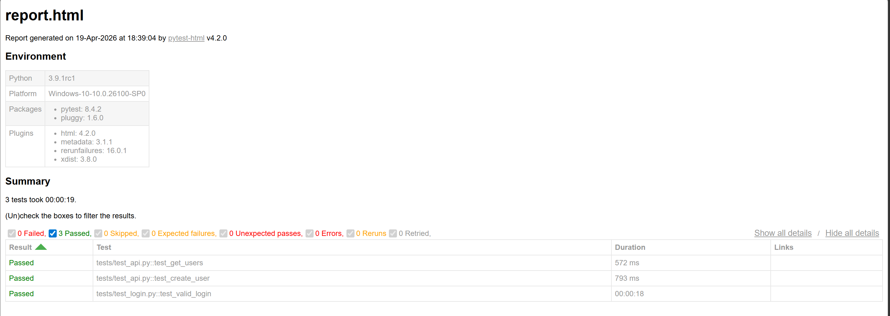
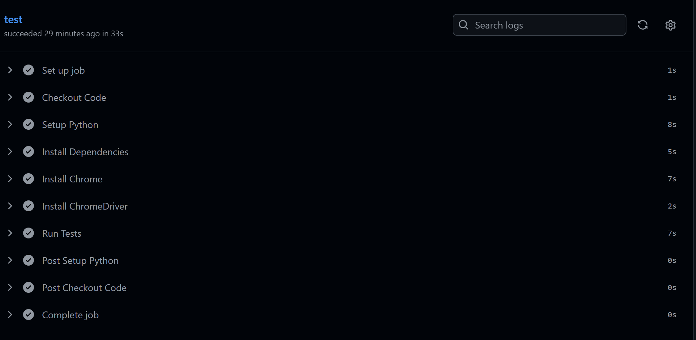

# 🚀 AutoTest Nexus

## 📌 Overview

AutoTest Nexus is a scalable automation testing framework built in Python that supports both **UI and API testing**.  
It follows industry-standard QA practices including **test case design, bug reporting, and test execution reporting**, making it a complete testing solution suitable for real-world applications.

---

## 🧪 Key Features

* 🌐 UI Automation using Selenium WebDriver with scalable test design  
* 🔌 API Testing using Python `requests` for validating REST endpoints  
* 🧱 Page Object Model (POM) architecture for reusable and maintainable code  
* ⚡ Parallel test execution using `pytest-xdist` for faster test runs  
* 🔁 Retry mechanism to handle flaky tests and improve reliability  
* 📊 HTML reporting using PyTest for detailed test execution insights  
* 🧠 Data-driven testing using external JSON data for multiple scenarios  
* 📝 Logging system for debugging and execution traceability  
* 🔄 CI/CD integration using GitHub Actions for automated test execution  
* 🧪 Support for functional, regression, and integration testing  
* 🛠 Designed following real-world QA workflows including test case design, execution, and reporting  

---

## 🛠 Tech Stack

* Python  
* Selenium  
* PyTest  
* Requests  
* PyTest Plugins (xdist, html, rerunfailures)  
* GitHub Actions  

---

## 📁 Project Structure

---

## ▶️ How to Run

### 1️⃣ Clone Repository

### 2️⃣ Create Virtual Environment

### 3️⃣ Install Dependencies

### 4️⃣ Run Tests

### 5️⃣ Run Tests in Parallel

### 6️⃣ Run with Retry Mechanism

---

## 📸 Test Execution Report

Below is a sample HTML report generated after running the test suite:

---

## 🔁 CI/CD Pipeline

Automated tests run on every push using GitHub Actions.

---

## 📄 QA Documentation

This project includes complete QA artifacts:

* **Test Cases** → `docs/test_cases.md`  
* **Bug Reports** → `docs/bug_report.md`  
* **Test Execution Report** → `docs/test_report.md`  

---

## 🎯 Use Cases

* Functional UI testing of web applications  
* Backend API validation  
* Regression testing  
* Demonstration of complete QA workflow  

---

## 📈 Future Enhancements

* Docker integration  
* Jenkins pipeline  
* Advanced reporting dashboards  
* Integration with test management tools  

---

## 👩‍💻 Author

Srishti Jaiswal  
https://github.com/Srishti-04
