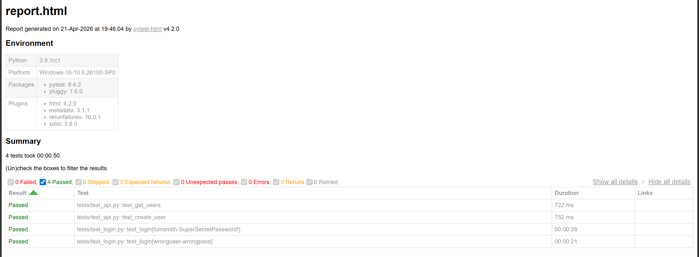

# 🚀 AutoTest Nexus

## 📌 Overview

AutoTest Nexus is a scalable automation testing framework built in Python that supports both **UI and API testing**.  
It follows industry-standard QA practices including **test case design, bug reporting, and test execution reporting**, making it a complete testing solution suitable for real-world applications.

---

## 🧪 Key Features

- 🌐 UI Automation using Selenium WebDriver with scalable and maintainable test design  
- 🔌 API Testing using Python `requests` for validating RESTful endpoints and response data  
- 🧱 Page Object Model (POM) architecture for reusable, modular, and clean code structure  
- ⚡ Parallel test execution using `pytest-xdist` to optimize execution time  
- 🔁 Retry mechanism using `pytest-rerunfailures` to handle flaky tests and improve stability  
- 📊 HTML reporting using PyTest for detailed execution insights and result tracking  
- 🧠 Data-driven testing using external JSON data to validate multiple test scenarios efficiently  
- 📝 Centralized logging system for debugging, traceability, and failure analysis  
- 🔄 CI/CD integration using GitHub Actions for continuous automated test execution  
- 🧪 Support for functional, regression, and integration testing across different layers  
- 📈 Performance awareness through concurrent execution and response validation  
- 🛠 Designed following real-world QA workflows including test case design, execution, defect tracking, and reporting  

---

## 🛠 Tech Stack

Python, Selenium, PyTest, Requests, GitHub Actions

---

## 📁 Project Structure

```
AutoTest-Nexus/
│── tests/
│── pages/
│── api/
│── utils/
│── assets/
│── docs/
│── testdata.json
│── conftest.py
│── pytest.ini
│── requirements.txt
│── README.md
```

---

## ▶️ How to Run

### 1. Clone Repository

```
git clone https://github.com/Srishti-04/AutoTest-Nexus.git
cd AutoTest-Nexus
```

### 2. Create Virtual Environment

```
python -m venv venv
venv\Scripts\activate
```

### 3. Install Dependencies

```
pip install -r requirements.txt
```

### 4. Run Tests

```
pytest --html=report.html
```

### 5. Run Tests in Parallel

```
pytest -n auto
```

### 6. Run with Retry

```
pytest --reruns 2
```

---

## 📸 Test Report



---

## 🔁 CI/CD Pipeline

Automated tests run on every push using GitHub Actions.


---

## 📄 QA Documentation

- Test Cases → docs/test_cases.md  
- Bug Reports → docs/bug_report.md  
- Test Execution Report → docs/test_report.md  

---

## 🎯 Use Cases

- Functional UI testing  
- API validation  
- Regression testing  
- End-to-end QA workflow demonstration  

---

## 📈 Future Enhancements

- Docker integration  
- Jenkins pipeline  
- Allure reporting  
- Cross-browser testing  

---

## 👩‍💻 Author

Srishti Jaiswal  
https://github.com/Srishti-04
